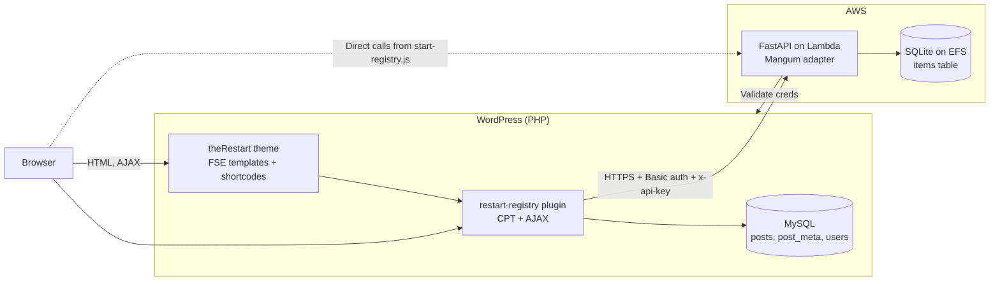
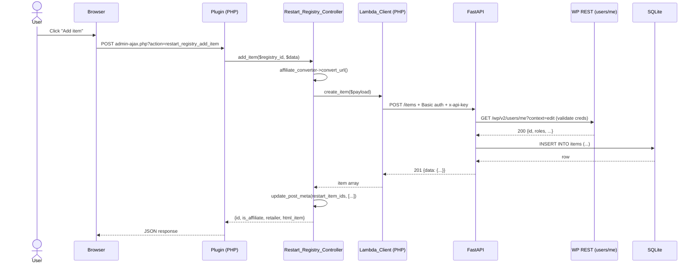

# Architecture

This page is the system-level mental model. Read it once before working on any
component — many of the choices in the code only make sense after you know how
data flows between WordPress, the plugin, and the Lambda.

## System diagram



## Component responsibilities

### WordPress + theme

Owns the public-facing site. Renders templates, runs the login/register/account
forms, and brokers all browser interaction. The theme registers five
shortcodes (`[restart_start_registry]`, `[restart_my_account]`,
`[restart_login_form]`, `[restart_register_form]`, `[restart_my_registries]`)
and three JS bundles (`auth.js`, `start-registry.js`, `contact-modal.js`).

### Plugin (`restart-registry`)

Owns registry data. A registry is a `restart-registry` custom post type:

- The post is the registry. `post_author` is the owner.
- `post_status = 'publish'` → public; `'private'` → invitee-only.
- Post meta stores everything that is not a column on `wp_posts`.

The plugin renders three shortcodes (`[restart_registry]`,
`[restart_registry_view]`, `[restart_registry_create]`), handles ten AJAX
actions (one of which is `nopriv`), and proxies item operations to the Lambda.

### Lambda (`Restart_Registry_Lambda`)

Owns item data. A FastAPI app (`app.main:app`) wrapped with `Mangum` for AWS
Lambda. Mounted in API Gateway. Persists to a single SQLite file on EFS so
multiple Lambda instances can share state.

It has **no user table**. Authentication is delegated back to WordPress on
every request (with a 5-minute in-memory cache).

## Data flow — adding an item

A walk-through of the most common write path:



## Auth flow

The system uses **WordPress Basic auth as the only credential**. There are no
JWTs, no Lambda-issued tokens, no separate user store.

1. The browser submits credentials to WordPress (login form, application
   password, or — in `start-registry.js` — an application password is
   auto-created server-side and localized into the page).
2. The plugin (or the browser, in the start-registry case) sends `Authorization:
   Basic <base64(user:app_pwd)>` and an `x-api-key` header to the Lambda.
3. The Lambda's `get_current_user` dependency calls
   `wp_python.WordPressClient.users.me(context="edit")` against `WP_BASE_URL`.
4. WordPress validates the application password and returns the user; the Lambda
   wraps the response in a `WPUser` model and caches it for `WP_AUTH_CACHE_TTL`
   seconds (default 300).
5. Authorization is enforced inside each route — `is_owner`, `is_invitee`,
   `user.is_admin` — using the resolved `WPUser`. Non-admin item responses use
   the `ItemPublic` model, which **omits** affiliate fields.

!!! note "Two layers of credentials at the API Gateway"
    Production also enforces an API Gateway `x-api-key` (a separate static
    secret). The plugin sends both headers — `x-api-key` lets the request
    through API Gateway, `Authorization: Basic` lets it through the FastAPI
    `get_current_user` dependency.

## WordPress data model

Each registry is one `restart-registry` post:

| Source | Field | Purpose |
|--------|-------|---------|
| `wp_posts.post_title` | Title | Registry name |
| `wp_posts.post_content` | Description / story | Free-text body |
| `wp_posts.post_status` | `publish` / `private` | Public vs invitee-only |
| `wp_posts.post_author` | User ID | Registry owner |
| `wp_postmeta` | `restart_item_ids` | JSON array of Lambda item IDs (preserves order) |
| `wp_postmeta` | `restart_invitees` | JSON array of usernames or emails |
| `wp_postmeta` | `restart_event_type` | e.g. `divorce`, `relocation`, `getting-out` |
| `wp_postmeta` | `restart_event_date` | ISO date for the registry occasion |
| `wp_postmeta` | `restart_shipping_address` | JSON object — `name`, `address_1`, `address_2`, `city`, `state`, `postal_code`, `country`. Optional. **Visibility: registry owner and invitees only — never rendered on the public/unauthenticated view.** |
| `wp_postmeta` | `restart_purchase_messages` | JSON array of purchase message records |
| `wp_postmeta` | `restart_is_for_self` | `'1'`/`'0'` — whether the registry is for the creator |
| `wp_postmeta` | `restart_recipient_name` | Name of the recipient (when `is_for_self = 0`) |
| `wp_postmeta` | `restart_recipient_relationship` | Relationship between creator and recipient |
| `wp_postmeta` | `restart_recipient_email` | Optional email for the recipient |

The plugin's controller (`Restart_Registry_Controller::post_to_registry`)
flattens these into a uniform array — `id`, `user_id`, `title`, `description`,
`is_public`, `permalink`, `share_key`, `meta`, `items`.

!!! tip "`share_key` is just the post ID"
    Earlier versions of the plugin used a separate share key column. It is
    gone — `share_key` in current code is an alias for `post_id`. The
    `?registry=<key>` query parameter accepts either the numeric post ID or
    the post slug.

## Lambda data model

A single SQLite database with one user-facing table:

```sql
CREATE TABLE items (
    id INTEGER PRIMARY KEY AUTOINCREMENT,
    registry_id INTEGER,
    name TEXT NOT NULL,
    description TEXT,
    url TEXT NOT NULL,
    retailer TEXT,
    affiliate_url TEXT,
    affiliate_status TEXT,
    image_url TEXT,
    price REAL,
    quantity_needed INTEGER NOT NULL DEFAULT 1,
    quantity_purchased INTEGER NOT NULL DEFAULT 0,
    is_active INTEGER DEFAULT 1,
    created_at TIMESTAMP DEFAULT CURRENT_TIMESTAMP,
    updated_at TIMESTAMP DEFAULT CURRENT_TIMESTAMP
);
CREATE INDEX idx_items_registry_id ON items(registry_id);
```

Rows are never deleted in production code paths — `DELETE /items/{id}` flips
`is_active = 0`. Migrations are tracked with a `SCHEMA_VERSION` constant; see
[Database](lambda/database.md).

## Release process

Each component has its own version, tag prefix, and release pipeline:

| Component | Version source | Tag prefix | Pipeline |
|-----------|----------------|------------|----------|
| Plugin | `plugin/restart-registry.php` header | `plugin/v*` | `release-plugin.yml` (builds zip, attaches to GH release) |
| Lambda | `lambda/pyproject.toml` | `lambda/v*` | `deploy-staging.yml` / `deploy-prod.yml` (zip + layer + AWS CLI) |
| Theme | `theme/style.css` header | `theme/v*` | Currently manual: `make theme-pack` produces a zip artifact |

Bump versions with `./scripts/bump.sh <component> <patch|minor|major>` (or
`make bump-plugin-patch`, `make bump-lambda-minor`, etc.). The script edits the
relevant version source and creates a `<component>/v<version>` git tag.

!!! note "One repo, three CHANGELOGs"
    There is no top-level CHANGELOG. Each component carries its own release
    notes inside the GitHub release body for its scoped tag.
