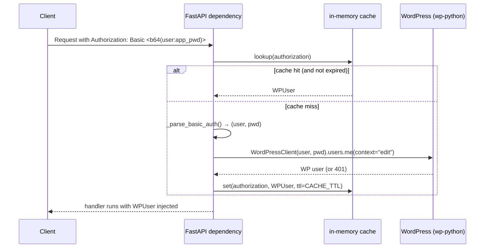

# Authentication

The Lambda has no users database. Every protected request is authenticated by
calling back to WordPress with the credentials supplied by the client.

## The flow, end to end



The dependency is in `app/auth/dependencies.py`:

- `get_current_user(request: Request) -> WPUser` — extracts `Authorization`,
  validates, and returns a `WPUser`. Raises `401` on missing or invalid
  credentials. Validation is offloaded to `loop.run_in_executor()` so the
  blocking HTTP call to WordPress does not stall the event loop.
- `require_roles(*roles)` — factory that returns a sub-dependency requiring
  `WPUser.has_role(...)` for at least one of the given roles. Raises `403`
  otherwise.

## `validate_credentials(authorization: str) -> WPUser | None`

Lives in `app/auth/wp_client.py`. The implementation:

1. Look up the raw `Authorization` header in `_cache`. If present and not
   expired, return the cached `WPUser`.
2. `_parse_basic_auth` — base64-decode the `Basic <...>` header into
   `(username, password)`. Return `None` if the header is malformed.
3. Construct `WordPressClient(WP_BASE_URL, auth=ApplicationPasswordAuth(...),
   timeout=10.0)` and call `.users.me(context="edit")` inside a `with` block
   so the underlying HTTP session is closed.
4. Catch `AuthenticationError`, `WordPressError`, and a broad `Exception` —
   any failure returns `None`.
5. Build a `WPUser` (id, username, email, display_name, roles, capabilities)
   from the WP response.
6. Cache it for `CACHE_TTL` seconds and return.

## `WPUser`

```python
class WPUser(BaseModel):
    id: int
    username: str
    email: str
    display_name: str
    roles: list[str]
    capabilities: dict[str, bool] = {}

    def has_role(self, role: str) -> bool: ...
    def has_capability(self, cap: str) -> bool: ...

    @property
    def is_admin(self) -> bool:
        return "administrator" in self.roles
```

`is_admin` drives the response-shape switch in the items routes — admins
get `Item` (with affiliate fields), everyone else gets `ItemPublic` (without).

## Caching

```python
CACHE_TTL = float(os.environ.get("WP_AUTH_CACHE_TTL", "300"))
```

Defaults to **5 minutes** and is keyed on the raw `Authorization` header
string. Tuning notes:

- A longer TTL reduces the wp-python round-trip frequency but increases the
  window in which a revoked application password still works on the Lambda.
- A shorter TTL is appropriate for development/test environments where
  permissions change frequently.
- Use `clear_cache()` (exported from `app/auth/wp_client.py`) in tests if you
  need to force re-validation.

## Role-based access

Most authorization in this codebase is *not* role-gated — it is
ownership-gated (e.g. "the registry's `post.author == user.id`"), with admins
allowed to bypass via `user.is_admin`. The `require_roles` dependency exists
for endpoints that should be locked down to a specific WP role:

```python
from fastapi import Depends
from app.auth import require_roles

@router.get("/admin-only", dependencies=[Depends(require_roles("administrator"))])
def admin_only_view(): ...
```

## Production considerations

- `WP_BASE_URL` must point at a WordPress install whose REST API is reachable
  from the Lambda's VPC. In production, this is the public WordPress URL.
- API Gateway adds an `x-api-key` requirement on top of Basic auth — a static
  shared secret. The plugin sends both headers (see
  [Lambda Client](../plugin/lambda-client.md)).
- Application passwords are 24-char tokens and should be the only credential
  stored on disk on either side of the boundary. Never use the WP user's
  primary password.
